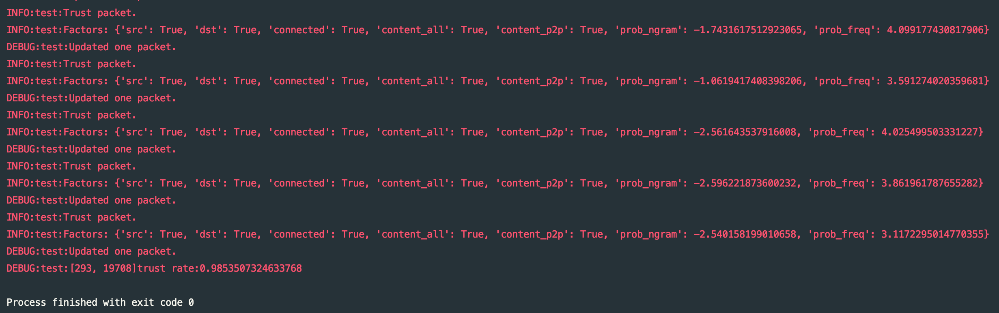

# Monitor

> 基于N-gram和频率分析的流量安全分析模型

## 项目概况
主要用途为在工厂环境下分析（非特定协议）流量包安全。

## 项目目的
在工厂环境下的流量主要内容为工控协议流量包，在机器运行期间，机器之间的发包内容和频率大致稳定，且上下文之间存在某些特定的规律。

而工厂环境下的流量安全分析，虽然可以通过硬编码人为指定上下文关系和机器发包内容，但是发包规律难以穷举，且容易随时间发生变化。

这时就需要采用一些机器学习的方法，从机器的发包模式中抽取出规律并建立统计模型，进而用于判断流量状态是否安全。

本项目主要检测的异常分为两类：

### 包内容异常
- 包内容为未出现的新类型
- 包内容为不符合上下文的异常
### 包频率异常
- 当前包的出现，与同类型（同内容）包在历史记录中出现的频率存在较大差异

## 核心思路
思路部分主要按照检测的异常，分为两部分：

### 分析包内容的合理性
主要基于[N-gram模型](https://en.wikipedia.org/wiki/N-gram)，分析数据包与其上文的共现概率判断合理性。
- 将数据包内容经过编码作为一个特定字符（单词），通过上下文的n-gram切割，统计得到不同数据包的共现概率（coappearance）表，即二元词表。
- 获取新数据包后，联系其上文的n-gram（可自定义，默认窗口大小为5，这是一个经验值），结合共现概率得到当前数据包的合理性。
- 依据一定的阈值判断（默认为-10，这是一个经验值，认为在窗口大小为5的情况下，平均两个相邻词的频概率所分配的概率不小于$e^{-2.5}=0.08$）
- 根据判断结果实时更新共现概率表。

### 分析包频率的合理性
主要基于统计学原理，对数据包在此前一段时间的出现频率（单位：个/秒）进行统计，针对均值和标准差等统计信息进行统计。
- 预先对历史数据进行分析，抽取均值和标准差数据。
- 对新数据包，首先收集相同内容包的上文中，时间间隔为1s的包的数量，然后进行判断其近期频率，使用k-sigma原则。
  - 实验发现，k=4.5的时候能够较好地保留正常的包，但是目前缺少负样本故无法确认其分类效果。
- 根据判断信息实时更新频率（待细化）。

## 特性
### 实时更新策略

根据包的分析结果，实时改变判断策略以适应新的数据特征。

具体而言，如果判断为信任packet，那么就将其加入历史记录和分析数据。

- N-gram更新：将新的packet与其上一个内容加入相关session对应的bigram表，在之后将会得到重新计算
- Frequency频率更新：在历史记录被替换条目占总记录的比例达到阈值时进行，重新计算频率
- 历史记录的替换：历史记录在超过一定条目限制时会自动去除最早的一条记录

### 泛化性较好

因为没有保留数据包的语义信息，所以不依赖或针对具体的包类型或者协议类型。

### 可配置策略

目前明确可开放的接口（待讨论）

- （预期）模型分析得出结论仅作为参考，对额外的分析开放了接口，可以配置高层策略以实现更好的安全分析

## 截图

- 实验：2w条历史数据+2w条测试数据

多次测试效果相近，如下：

## 结果与问题分析

实验结果：能够较好地保留正常的包。

现存问题：

1. 经验值缺乏数学论证。
2. 未知在非正常包上的效果。
3. 可配置的上层接口未定义。

## 近期计划

近期计划在全体包数据（不仅仅是CIP包）上进行测试查看泛化性能。

进行更大规模测试。